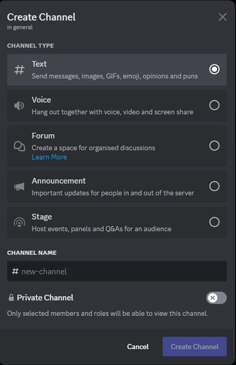

# Related to channel

In a discord server you can create multiple channels

You can create a text channel, convert it in announcement channel

You can create a voice channel, stage channel, forum channel, thread channel, etc

<figure><figcaption>
You need the permission "MANAGE_CHANNELS"
</figcaption></figure>
